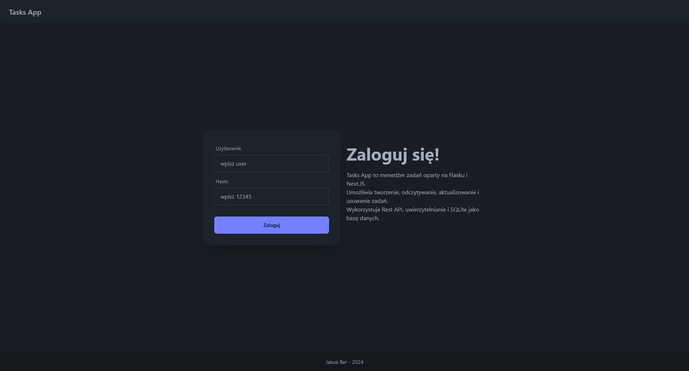

# Task Manager API


## Description

Task Manager API is user-friendly task management application, designed to streamline task organization and tracking.
Utilizing the Flask framework for the backend and Next.js for a frontend experience,
this application offers a comprehensive solution for managing tasks effortlessly.
It also uses basic token authentication and SQLite as a database.

## Features

- Create, read, update, and delete tasks
- Basic Token authentication
- SQLite database for storing tasks
- Test cases using unittest

## API
- GET /tasks - Retrieve all tasks
- GET /tasks/<task_id> - Retrieve a specific task
- POST /tasks - Create a new task
- PUT /tasks/<task_id> - Update an existing task
- DELETE /tasks/<task_id> - Delete a task

## Authentification
App requires to all API tasks basic credential authentification.
Because of its only demostration purposes, two possible credentials will be presented below:

    User: admin
    Password: 12345

    User: user
    Password: 12345

## Tests
App uses unittest to test its funcionalities, it tests 6 most important cases:
- Tests access to the GET tasks endpoints.
- Tests creating a new task.
- Tests updating a task.
- Tests deleting a task.
- Tests not creating a new task with bad credentials.
- Tests not updating a task with bad credentials.
- Tests not deleting a task with bad credentials.

## Screenshots




## Roadmap

- App has all planed funcionalities.


## Deployment and running of Server side (Flask API)

Clone the project and open in VSCode.

Go to the project directory

```bash
  cd tasks-app-backend
```

Create and activate virtual environment
For Windows:
```bash
  py -3 -m venv .venv
  .venv\Scripts\activate
```
Make sure right interpreter is selected in VSCode or IDE of your choice.


Install dependencies

Install everything from requirements.txt
```bash
    pip install -r requirements.txt
```

or install each pack seperately

```bash
    pip install Flask

    pip install flask-cors

    pip install Flask-JWT-Extended
```

Start the server

Run from VSCode or from command line:
```bash
    python app.py
```

If database is not copied with solution, app will create and fill with default data at first run.


## Deployment and running of Client side (Next.js website)

Clone the project and open in VSCode.

Go to the project directory

```bash
  cd tasks-app-frontend
```

Install dependencies

```bash
    npm i -D daisyui@latest

    npm install react-icons --save

    pip install Flask-JWT-Extended
```

Start the server

Run from VSCode or from command line:
```bash
    npm run dev
```

After successfully runing both server and client, website will be available localy under url:
```bash
    http://localhost:3000/
```

## Usefull links

 - [Next.JS](https://nextjs.org/)
 - [Flask](https://flask.palletsprojects.com/en/3.0.x/)
 - [DaisyUI](https://daisyui.com/)
  - [React-Icons](https://react-icons.github.io/react-icons/)